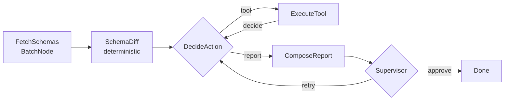

# DBCompare

An agentic AI that compares two Postgres databases — tables, columns, types, constraints,
indexes and row-level data — and writes a review-ready report. Built on
[PocketFlow](https://github.com/The-Pocket/PocketFlow), managed with
[uv](https://docs.astral.sh/uv/), with a Streamlit frontend.

The design borrows patterns from the PocketFlow cookbooks:

| Cookbook | What it contributes here |
|---|---|
| `pocketflow-agent` / `agentic-rag` | the decide → act → observe loop that chooses which comparison to run next |
| `pocketflow-tool-database` | a toolbox of real database operations the agent calls, including guarded SQL |
| `pocketflow-supervisor` | a reviewer node that checks the report against the evidence and can send it back |
| `pocketflow-thinking` | every decision carries an explicit `thinking` block, shown in the UI |

**The division of labour matters:** the *facts* (does column `amount` differ, is row 7
modified) are computed in plain Python and never generated by the model. The LLM only
decides what to investigate next and how to explain the findings, so the numbers in the
report can't be hallucinated.

---

## Quick start

```bash
cd DBCompare
uv sync                       # creates .venv and installs everything
cp .env.example .env          # then set OPENAI_API_KEY and your Postgres password
uv run setup_test_data.py     # builds the two sample databases
uv run check_setup.py         # verifies Postgres + your OpenAI key
uv run streamlit run app.py   # http://localhost:8501
```

No `pip install`, no `activate`: `uv run` resolves the environment each time.

### Using your OpenAI key

`.env`:

```ini
LLM_PROVIDER=openai
OPENAI_API_KEY=sk-proj-...
LLM_MODEL=gpt-4o          # or gpt-4o-mini, gpt-4.1, gpt-5, o4-mini ...
# OPENAI_BASE_URL=...     # optional: Azure, a gateway, or a local compatible server
```

`uv run check_setup.py` makes one tiny call and prints the reply, so you know the key and
model work before running a whole agent loop. Reasoning models that reject `max_tokens` are
handled automatically — the wrapper retries with `max_completion_tokens`.

To use Claude instead: `uv sync --extra anthropic`, then set `LLM_PROVIDER=anthropic`,
`ANTHROPIC_API_KEY=...` and `LLM_MODEL=claude-sonnet-5`.

### Other ways to run

```bash
uv run main.py                                    # CLI, writes last_run.json
uv run main.py "Is it safe to promote stage to prod?"
LLM_PROVIDER=mock uv run main.py                  # full agent loop, no API key, no cost
LLM_PROVIDER=mock uv run pytest                   # 12 tests
```

---

## The sample databases

`uv run setup_test_data.py` drops and recreates `shop_prod` (A, baseline) and `shop_stage`
(B, candidate) with differences planted on purpose:

| Kind | Difference |
|---|---|
| Table | `products` only in A, `inventory` only in B |
| Column | `customers.is_active` only in A, `customers.loyalty_tier` only in B |
| Type | `customers.email` varchar(120) → varchar(255); `orders.amount` numeric(10,2) → double precision |
| Constraint | `orders.status` NOT NULL → NULL |
| Index | `idx_orders_status` only in B |
| Data | customer 3 email, customer 5 country, order 7 amount, order 10 status, items 4 and 17 qty |
| Rows | customer 8 and order 12 missing in B; customer 9 and order 13 only in B |

`orders` deliberately keeps the same row count on both sides while containing two modified
rows, so count checks alone can't pass the test. Every difference above is asserted in
`test_project.py`, which makes the suite double as a fixture spec.

---

## How the flow is wired



`flow.py` is that diagram verbatim:

```python
fetch >> schema_diff >> decide
decide - "tool"   >> execute
execute - "decide" >> decide
decide - "report" >> report
report - "supervise" >> supervisor
supervisor - "retry"   >> decide
supervisor - "approve" >> done
```

### The shared store

```python
shared = {
    "question":     "...",            # what the user asked
    "schema":       {"a": {...}, "b": {...}},
    "schema_diff":  {...},            # computed, not generated
    "history":      [{tool, params, thinking, observation, raw}, ...],
    "data_diffs":   {"customers": {...}},
    "report":       "# Database comparison report ...",
    "reviews":      [{approve, feedback}],
    "trace":        [...],            # progress lines shown in the UI
}
```

### The agent's toolbox (`tools.py`)

| Tool | Purpose |
|---|---|
| `compare_schema` | re-read both schemas, full structural diff |
| `compare_row_counts` | cheap first move: volumes per common table |
| `compare_table_data` | primary-key row diff of one table: missing and modified rows |
| `sample_rows` | look at real rows from one side |
| `run_sql` | any read-only SELECT, e.g. `SELECT status, count(*) FROM orders GROUP BY status` |
| `finish` | stop investigating and write the report |

`run_sql` rejects multiple statements and anything that is not `SELECT`/`WITH`, connections
open read-only with a 30s statement timeout, and identifiers go through
`psycopg2.sql.Identifier`.

---

## Adapting it to your own databases

1. Set `DB_A_NAME` / `DB_B_NAME` (and host/user) in `.env` or in the Streamlit sidebar.
   Different servers? Change `config.dsn_a()` / `config.dsn_b()` to two full DSNs.
2. Big tables: row comparison pulls up to `ROW_COMPARE_LIMIT` rows per side into memory.
   Beyond a few hundred thousand rows, replace the body of `compare_table_data` with a
   checksum-per-block strategy (`md5(t::text)` aggregated over PK ranges) and only pull the
   blocks whose checksums disagree.
3. Another engine (MySQL, Snowflake): only `utils/db.py` is Postgres-specific. Keep
   `fetch_schema` returning the same dictionary shape and the rest is unchanged.
4. More investigative power: add a function to `tools.execute_tool`, describe it in
   `TOOL_CATALOG`, add the name to `VALID_TOOLS`. The agent picks it up with no other changes.

## Files

```
pyproject.toml        uv project definition and dependency groups
.env.example          every setting, OpenAI-first
config.py             env-driven settings and DSNs
setup_test_data.py    builds the two sample databases
check_setup.py        preflight: Postgres reachable, sample data present, key working
utils/db.py           introspection, row fetch, guarded SELECT
utils/differ.py       deterministic schema and row diffing
utils/call_llm.py     openai / anthropic / mock providers + YAML extraction
tools.py              the agent's toolbox
nodes.py              PocketFlow nodes
flow.py               graph wiring
main.py               CLI
app.py                Streamlit UI
test_project.py       pytest suite (12 tests)
HISTORY.md            build log: what was created, in what order, and why
```
